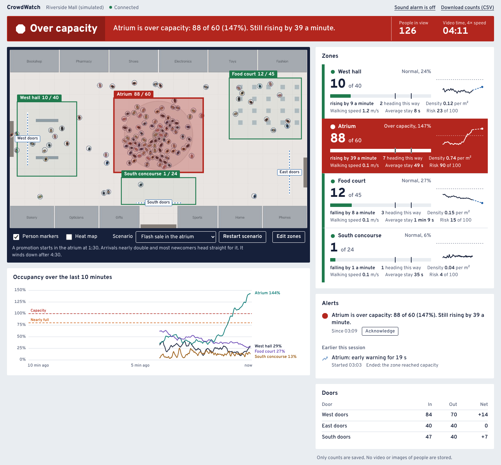
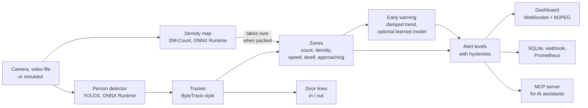

# CrowdWatch

Real-time overcrowding detection for malls, stations and other public places, from ordinary CCTV video.

CrowdWatch counts the people in each area you care about, compares the count with what that area can safely hold, and tells you **before** it fills up: "Atrium is filling up: 37 of 60 now, rising by 24 a minute, 9 more heading this way. Full in about 1 minute."



It runs on a laptop CPU with no GPU, and stores only numbers: no video and no images of people.

## Try it in two minutes

No camera needed. A built-in simulator plays out a busy mall seen from a ceiling camera.

```bash
pip install -e .
crowdwatch demo
```

If your system says the `crowdwatch` command is not found (common on Windows, when Python's Scripts folder is not on PATH), use `python -m crowdwatch` in its place: `python -m crowdwatch demo`.

The dashboard opens at http://localhost:8000. The default scenario is a flash sale: a promotion starts 90 seconds in, the atrium fills over the next minute or two, and it goes over capacity at around the three minute mark. The simulation runs at 4x speed, so that is about 45 seconds of your time. Pick other scenarios from the menu under the live view.

To watch a real video file, a webcam or a network camera:

```bash
crowdwatch video path/to/video.mp4 --capacity 40     # a recording
crowdwatch video 0                                   # the first webcam
crowdwatch video rtsp://192.168.1.20:554/stream1     # an IP camera
crowdwatch video crowd.mp4 --capacity 300 --dense    # packed crowds: add the density model
```

The person detector (about 34 MB) is downloaded once on first use. The whole picture starts as a single zone; choose **Edit zones** in the dashboard to draw your own.

## What it does

| | |
|---|---|
| **Counts people per zone** | Draw any number of zones on the picture. Each has a capacity, given directly or worked out from its floor area. |
| **Handles packed crowds** | A density-map network takes over from the person detector when a zone gets too dense to pick people out one by one. On a public benchmark this cut the counting error from 100 people per image to 13 ([details](#counting-accuracy-on-real-images)). |
| **Warns early** | A short-horizon forecast says when a zone will be full if the current rise continues. |
| **Stays calm** | One alert per episode, raised only when a level holds for a few seconds and cleared only when the zone is clearly back under. No alarm chatter. |
| **Explains itself** | Every alert is a plain sentence with the numbers behind it. |
| **Counts doors** | Directional in/out counters on any line you draw across a doorway or corridor. |
| **Sees who is coming** | Counts the people walking towards each zone, from the direction of their tracks. |
| **Flags stalled crowds** | In zones marked as walkways, a dense crowd that has stopped moving is called out. |
| **Talks to AI assistants** | An MCP server lets assistants such as Claude query the live system in plain language. |
| **Fits into monitoring** | Prometheus metrics at `/metrics`, a webhook for alert changes, CSV export, Docker and CI. |
| **Respects privacy** | Heads are pixelated in the live view, and only counts are written to disk. |

## How it works



1. **Detect.** Each analysed frame goes through YOLOX, keeping only the "person" class. YOLOX is used because its weights are Apache-2.0 licensed and ship as ONNX files, so the base install is small and needs no PyTorch.
2. **Track.** A tracker written for this project, in the style of ByteTrack, follows each person from frame to frame, including its own exact matching step (the Hungarian algorithm), so the core needs nothing heavier than NumPy. This is what turns flickering detections into a steady count: someone hidden behind another person for a second is still counted. Half-hidden people, who come back from the detector with low confidence, keep their track alive but cannot start a new one. Tracking also gives direction, speed and dwell time, which a detector alone cannot.
3. **Count packed crowds differently.** In a tight crowd most people are mostly hidden and a box detector finds only a fraction of them. With `--dense`, a density-map network (DM-Count) runs every couple of seconds beside the tracker. It estimates how many people are in every patch of the picture without separating them, and the count for a zone is the sum inside its outline. The tracker stays in charge while people are spread out; the density estimate takes over once it is clearly higher.
4. **Measure each zone.** A person belongs to a zone if the point where they stand is inside its outline. With a camera calibration (four points matched between picture and floor plan) density comes out in people per square metre and speed in metres per second. People outside a zone whose track is heading into it are counted as approaching.
5. **Forecast.** A straight line is fitted to the last 45 seconds of the count and extended two minutes ahead, with the trend assumed to fade over time (a damped trend) so a short burst is not extrapolated into a disaster. A rise is only believed if it is larger than the zone's ordinary coming and going, which is measured from the tracks, and if the people in the zone are slowing down rather than streaming through.
6. **Decide.** Occupancy maps to four levels: normal, busy (60%), nearly full (80%) and over capacity (100%). A level must hold for 3 seconds before it is raised and the zone must be clearly below it for 15 seconds before it is lowered.

Everything runs on the video's own clock rather than the wall clock, so a recording gives the same result every time and the simulator can be run far faster than real time for testing.

## Counting accuracy on real images

Measured on ShanghaiTech Part B, a standard public crowd-counting benchmark: street scenes with 9 to 539 hand-counted people per image, 124 on average. Neither model was trained on it. Figures are the mean absolute error in people per image, on every third test image (106 images).

| Counter | All images | Up to 50 people | 51 to 150 | More than 150 |
|---|---|---|---|---|
| Person detector, as the live tracker uses it | 100.3 | 18.8 | 73.1 | 205.5 |
| Person detector, tuned for counting stills | 70.8 | 6.7 | 43.1 | 165.1 |
| Person detector with 2x2 tiling | 45.2 | 15.2 | 18.9 | 114.5 |
| Density map | 13.4 | 1.7 | 8.3 | 30.6 |
| **Hybrid (what `--dense` runs)** | **13.4** | 1.8 | 8.3 | 30.6 |

A box detector alone misses most of a dense crowd. The density map is far closer at every crowd size, though it still runs low on the densest images. On all 316 test images the detector scores 74.8, and 49.9 with tiling; the density model was run on the subset only because it takes several seconds per image on the two-core machine used. Method, caveats and how to reproduce: [docs/benchmark.md](docs/benchmark.md).

The density model costs a second or more per frame on a CPU, which is why it refreshes every two seconds rather than on every frame, and it needs PyTorch once, to convert the published weights (`pip install torch`, then `crowdwatch fetch-model dmcount_qnrf`).

## Alerts and early warning on simulated crowds

60 simulated runs, 9.3 hours of mall time and 51 overcrowding events: the four hand-written scenarios with ten fresh random seeds each, plus 20 randomly generated afternoons. Nothing was tuned, trained or validated on these runs.

### Alarms

An overcrowding event is a zone at or above capacity for at least 10 seconds. There were 51 of them.

| | Per-frame threshold | Threshold on 2 s average | CrowdWatch |
|---|---|---|---|
| Overcrowding events caught | 49 of 51 | 44 of 51 | 47 of 51 |
| Separate alarms raised | 2920 | 204 | 47 |
| Alarms per real event | 56.6 | 4.0 | 0.9 |
| False alarms | 31 (3.3 an hour) | 1 (0.1 an hour) | 2 (0.2 an hour) |
| Delay after a zone truly fills (median) | 1.8 s | 8.8 s | 7.3 s |

### Early warning

How many events were announced in advance, how far ahead (median, with the middle 80% in brackets), and how many warnings were not followed by an event within 4 minutes.

| Method | Events warned of | Lead time | Warnings raised | Of which false |
|---|---|---|---|---|
| Damped-trend rule (the default) | 29 of 51 (57%) | 51 s (21 to 110) | 64 | 27 (42%) |
| Learned model (opt-in) | 41 of 51 (80%) | 40 s (13 to 181) | 90 | 42 (47%) |
| Rule, or the 'nearly full' level, whichever comes first | 44 of 51 (86%) | 56 s (29 to 206) | n/a | n/a |

The last row is what an operator actually gets by default: the forecast, backed up by the 'nearly full' level at 80% of capacity. That level is a statement of fact rather than a prediction, so it has no false-warning figure.

Both forecasts raise a lot of warnings that come to nothing. Most of the false ones are in the two scenarios built to provoke them: a zone that hovers just under its limit, and a crowd that walks straight through.

### Counting

- Mean error of the zone count: 0.82 people (per-frame detections alone: 1.35).
- Door counters: 35377 crossings counted against 36978 true (-4.3%).

Full report with a per-scenario breakdown: [docs/evaluation.md](docs/evaluation.md).

### What these numbers do and do not show

They come from the simulator, where the true number of people in every zone is known at every instant. The pipeline never sees that truth: it only gets detections that have been spoiled the way a real detector's are (people missed, more so in a crowd; occlusions lasting a second or more; jittery boxes; occasional false detections). So they are a fair test of the tracking, counting, forecasting and alert logic, and not a measurement on real footage.

### The learned early-warning model, and why it is not the default

The rule above extrapolates one number. I also trained a gradient-boosted model to predict "will this zone reach capacity within two minutes?" from thirteen signals the live system has, including how many people are walking towards the zone and how fast the doors are letting people in. It was trained on 60 randomly generated simulated afternoons and exported to ONNX.

The evidence is mixed. On the final test above it warned of 41 of the 51 events against the rule's 29, with a similar share of false warnings (47% against 42%) and a shorter typical lead (40 seconds against 51). On the two sets of simulated afternoons used while building it, the rule came out slightly ahead on balance (for example precision 82% and recall 74%, against 68% and 83% for the model). I chose the default before running the final test and have not changed it on the strength of the test, so the simpler rule stays the default and the model is a one-line switch:

```yaml
alerts:
  forecast_method: learned
```

Sixty afternoons, with a few dozen build-ups between them, is little to learn from, so more and more varied training data is the obvious next step: `crowdwatch train-warning --train 300`.

## Ask it questions (MCP)

CrowdWatch includes a [Model Context Protocol](https://modelcontextprotocol.io) server, the open standard AI assistants use to call tools. With it connected, an assistant can answer "which zone is busiest right now?", "how long was the atrium over capacity?" or "acknowledge the food court alert" from live data.

```bash
pip install -e ".[mcp]"
crowdwatch demo                                # in one terminal
crowdwatch mcp --url http://localhost:8000     # the MCP server, over stdio
```

For Claude Desktop, add this to its MCP configuration:

```json
{"mcpServers": {"crowdwatch": {"command": "crowdwatch", "args": ["mcp", "--url", "http://localhost:8000"]}}}
```

Tools: `get_live_status`, `get_zone`, `get_zone_history`, `list_alerts`, `get_door_counts` and `acknowledge_alert`.

## Setting it up for your own camera

Run `crowdwatch video <source>` once. It creates `crowdwatch-<name>.yaml` next to where you ran it and reuses it next time.

- **Zones:** choose **Edit zones**, then **Draw a new zone**, click the corners on the live view, and give the zone a name and a capacity. Drag corners to adjust. Zones are saved into the YAML file.
- **Capacity:** use the figure from your venue's safety assessment. If you only know the floor area, set `area_m2` and a `max_density`. As a starting point, crowd-safety guidance commonly assesses event spaces at about 2 people per square metre, notes that moving crowds stop flowing freely at 2 to 3, and treats about 5 as the upper limit for standing areas (see [Further reading](#further-reading)).
- **Door counters, calibration, thresholds, webhook:** edit the YAML. [`configs/camera_example.yaml`](configs/camera_example.yaml) documents every setting.

To process a recording with no dashboard and get an annotated video and a spreadsheet of counts:

```bash
crowdwatch analyze path/to/video.mp4 --capacity 40 --out annotated.mp4 --csv counts.csv
```

### Speed

Measured on a 2-core cloud CPU: `yolox_s` about 150 ms a frame, `yolox_tiny` about 50 ms. On a slow machine use `--model yolox_tiny` or lower `processing.fps` to 5; crowds change slowly, so 5 analysed frames a second is plenty. Live cameras never build up a backlog: if analysis falls behind, stale frames are dropped.

## Limitations

- **The densest crowds still run low.** Even the density model undercounts the most crowded benchmark images (more than 150 people) by about 13%, using weights that have never seen that kind of scene. Fine-tuning on footage from your own cameras is the fix; mounting cameras high and steep helps too.
- **Hybrid counting is verified on stills, not on live dense video.** The benchmark is still images, plus one short clip made from a dense image to check the wiring. I have not had dense real video with ground truth to test it on.
- **One camera, one view.** Zones cannot span cameras, and people are not followed from one camera to the next.
- **Forecasts are extrapolations.** They catch build-ups that are already under way. A sudden mass arrival gets little or no advance warning.
- **The early-warning model has only ever seen simulated crowds.**
- **Capacity is your number.** The system compares against the limit you give it. It does not know what is safe for your building.
- **No sign-in.** The dashboard and API have no user accounts. They listen only on your own computer unless you pass `--host 0.0.0.0`; put them behind a reverse proxy with authentication before exposing them.
- **A decision aid, not a safety system.** It has not been certified for life-safety use.

## API

Interactive documentation is served at `/api/docs`.

| Method and path | Purpose |
|---|---|
| `GET /api/state` | Latest snapshot: every zone, door counter and active alert |
| `WS /ws` | The same snapshot, pushed four times a second |
| `GET /stream.mjpg` | Live annotated video |
| `GET /api/history?seconds=600` | Recent counts per zone |
| `GET /api/alerts` | Alert log |
| `POST /api/alerts/{id}/ack` | Acknowledge an alert |
| `PUT /api/zones` | Replace the watched zones |
| `POST /api/view` | Switch markers, heat map and face blur |
| `GET /api/export.csv` | Download the stored counts |
| `GET /metrics` | Prometheus metrics |

## Project layout

```
crowdwatch/
  sources/        video files, cameras, and the crowd simulator
  detect/         YOLOX person detector, DM-Count density model, the simulator's stand-in
  tracking/       the ByteTrack-style tracker
  analytics/      zones, door lines, forecast, early-warning model, alert levels, heat map
  engine.py       ties detections to analytics; pure and deterministic
  pipeline.py     background threads: source -> detector -> engine -> storage
  server/         FastAPI app and the dashboard (plain HTML, CSS and JavaScript)
  mcp_server.py   MCP tools for AI assistants
  eval/           simulated evaluation, real-image benchmark, model training
  models/         the trained early-warning model (ONNX)
configs/          the demo setup and an annotated example for a real camera
docs/             evaluation and benchmark write-ups
tests/            the test suite, run with pytest
```

## Development

```bash
pip install -e ".[dev,mcp]"
pytest                          # the test suite
crowdwatch evaluate             # regenerate docs/evaluation.md (several minutes)
crowdwatch benchmark <folder>   # counting error on a labelled image set
crowdwatch train-warning        # retrain the early-warning model (needs ".[train]")
crowdwatch scenarios            # list the simulator scenarios
```

A `Dockerfile` and a GitHub Actions workflow are included. Neither has been run yet: build the image and push to GitHub to confirm them.

## Further reading

- Zhang et al., [ByteTrack: Multi-Object Tracking by Associating Every Detection Box](https://arxiv.org/abs/2110.06864), ECCV 2022.
- Ge et al., [YOLOX: Exceeding YOLO Series in 2021](https://arxiv.org/abs/2107.08430). Code and weights: [Megvii-BaseDetection/YOLOX](https://github.com/Megvii-BaseDetection/YOLOX), Apache-2.0.
- Wang et al., [Distribution Matching for Crowd Counting](https://arxiv.org/abs/2009.13077) (DM-Count), NeurIPS 2020. Weights as packaged by [LWCC](https://github.com/tersekmatija/lwcc).
- Zhang et al., "Single-Image Crowd Counting via Multi-Column Convolutional Neural Network", CVPR 2016, which introduced the ShanghaiTech dataset.
- G. Keith Still, [Static crowd density](https://gkstill.com/Support/crowd-density/CrowdDensity-1.html) and [Crowd density and flow](https://gkstill.com/Support/crowd-flow/DensityFlow.html), the source of the density figures quoted above.
- Gardner and McKenzie, "Forecasting trends in time series", Management Science, 1985, for the damped trend.

## Licence

MIT. The dashboard typeface is [Overpass](https://overpassfont.org/), under the SIL Open Font License.
